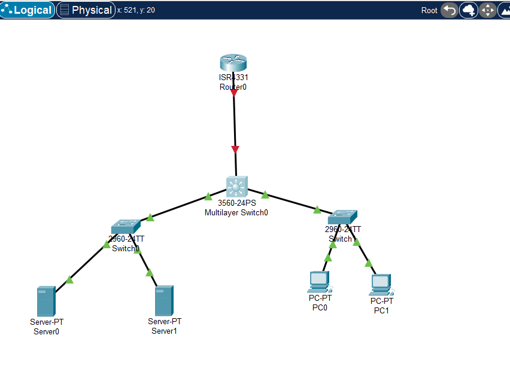

## Mini Data Center Network – Packet Tracer Project

### Overview
This project simulates a small data center network using Cisco Packet Tracer.
It demonstrates VLAN segmentation, inter-VLAN routing, and access control.

### Technologies Used
- Cisco Packet Tracer
- VLANs
- Layer 3 Switching
- Access Control Lists (ACLs)
- Trunking (802.1Q)

### Network Topology
      [ Router / ISP ]
              |
        [ Core L3 Switch ]
           /         \
 [ Access Switch 1 ]   [ Access Switch 2 ]
    |       |              |       |
  Servers  Servers        PCs     PCs

### VLAN Design
| VLAN ID | Name    | Subnet          | Purpose / Devices             |
| ------- | ------- | --------------- | ----------------------------- |
| 10      | SERVERS | 192.168.10.0/24 | Web, DB, File, Backup Servers |
| 20      | IT      | 192.168.20.0/24 | IT admin PCs                  |
| 30      | FINANCE | 192.168.30.0/24 | Finance department PCs        |
| 40      | HR      | 192.168.40.0/24 | HR department PCs             |
| 50      | GUEST   | 192.168.50.0/24 | Guest users / Internet only   |

### Security
- Guest VLAN restricted from server access
- IT VLAN allowed full access

### How to Test
- Ping tests between VLANs
- Verify Guest VLAN cannot reach servers
